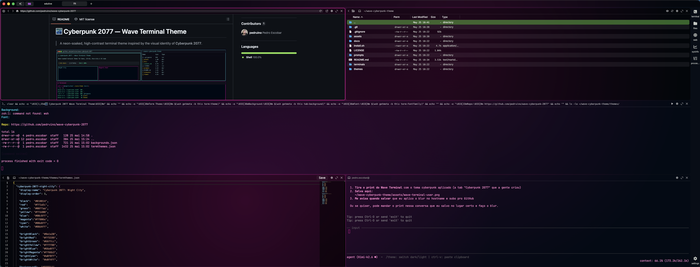
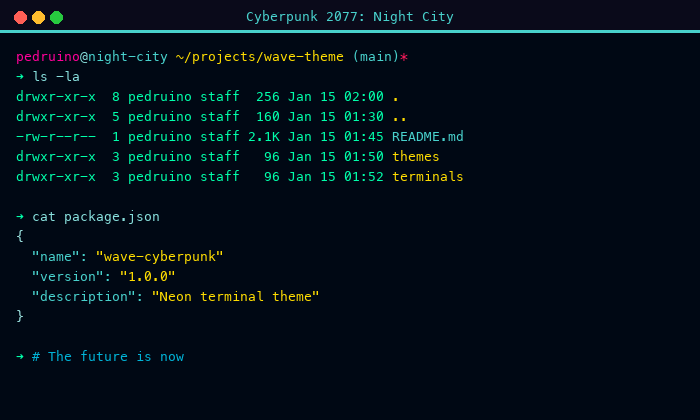
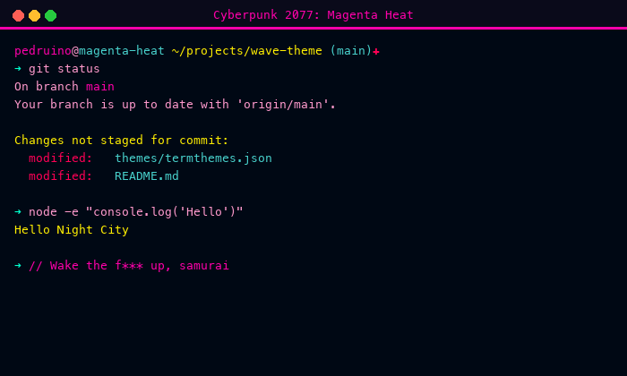

# 🌃 Cyberpunk 2077 — Wave Terminal Theme

> A neon-soaked, high-contrast terminal theme inspired by the visual identity of **Cyberpunk 2077**.



## ✨ Features

- 🌊 **Two variants**: Night City (cyan) and Magenta Heat (pink)
- ⚡ **True neon glow** via highly saturated ANSI colors
- 🎆 **Custom tab backgrounds** with radial gradient glow
- 🔣 **Optimized for Nerd Fonts** with icons and ligatures
- 🖥️ **Multi-terminal support**: Wave, iTerm2, Alacritty, VS Code

## 🎨 Color Palette

### Night City — Cyan Neon

| Role | Color | Hex |
|------|-------|-----|
| Background | Deep Void | `#000814` |
| Foreground | Cyan Glow | `#80d4ff` |
| Cyan | Neon Cyan | `#00e8ff` |
| Magenta | Neon Pink | `#ff006e` |
| Green | Acid Green | `#00ffaa` |
| Yellow | Electric Yellow | `#ffdd00` |
| Red | Hot Red | `#ff1a5c` |
| Blue | Electric Blue | `#00c8ff` |

### Magenta Heat — Pink Neon

| Role | Color | Hex |
|------|-------|-----|
| Background | Deep Void | `#000814` |
| Foreground | Pink Glow | `#ff88cc` |
| Magenta | Hot Pink | `#ff00aa` |
| Cyan | Neon Cyan | `#00e8ff` |
| Green | Acid Green | `#00ffcc` |
| Yellow | Electric Yellow | `#ffee00` |
| Red | Hot Red | `#ff0055` |

## 🚀 Installation

### Wave Terminal (Recommended)

```bash
# Clone the repo
git clone https://github.com/YOUR_USERNAME/wave-cyberpunk-2077.git
cd wave-cyberpunk-2077

# Install themes
cp themes/termthemes.json ~/.config/waveterm/
cp themes/backgrounds.json ~/.config/waveterm/

# Optional: install the Starship prompt
cp prompts/starship.toml ~/.config/

# Apply default theme (Magenta Heat)
# Edit ~/.config/waveterm/settings.json:
```

```json
{
  "term:theme": "cyberpunk-2077-magenta-heat",
  "tab:background": "bg@magenta-heat",
  "term:fontsize": 14,
  "term:fontfamily": "JetBrainsMono Nerd Font"
}
```

Restart Wave Terminal after installation.

### iTerm2

Double-click `terminals/iterm-cyberpunk-night-city.itermcolors` or import via:

```
Preferences > Profiles > Colors > Color Presets > Import
```

### Alacritty

Add to your `alacritty.yml`:

```yaml
import:
  - ~/.config/alacritty/cyberpunk.yml
```

Or copy `terminals/alacritty-cyberpunk.yml` to your config directory.

### VS Code

Add the contents of `terminals/vscode-terminal-theme.json` to your `settings.json` under `workbench.colorCustomizations`.

## 🎨 Tab Backgrounds

| Background | Description |
|-----------|-------------|
| `bg@neon-city` | 🔵 Cyan + 🟣 magenta radial glow |
| `bg@magenta-heat` | 🟣 Pink + 🔴 purple radial glow |

Apply via right-click on tab → Select Background.

## 🖥️ Recommended Setup

### 🔤 Font

**JetBrains Mono Nerd Font** (for icons and ligatures):

```bash
brew tap homebrew/cask-fonts
brew install --cask font-jetbrains-mono-nerd-font
```

### 🚀 Prompt (Optional)

Install [Starship](https://starship.rs) for the cyberpunk prompt:

```bash
curl -sS https://starship.rs/install.sh | sh
```

Then copy `prompts/starship.toml` to `~/.config/starship.toml`.

### 🛠️ Tools with Neon Colors

```bash
# Modern ls with colors
brew install eza

# Syntax-highlighted cat
brew install bat

# System monitor
brew install btop
```

## 📸 Screenshots

| Night City | Magenta Heat |
|-----------|-------------|
|  |  |

## 🤝 Contributing

Feel free to open issues or PRs with improvements, new terminal ports, or color adjustments.

## 📄 License

MIT — free to use, modify, and distribute.

---

> *"The world is yours have a nice day."* — Night City
